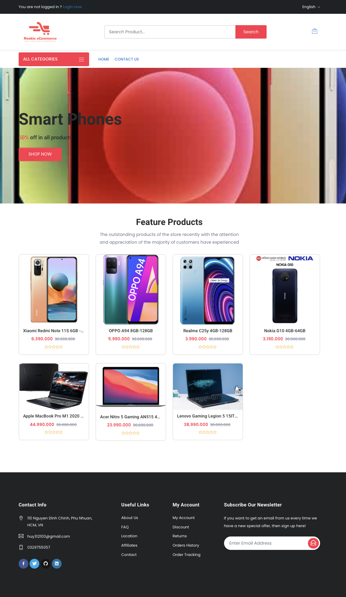
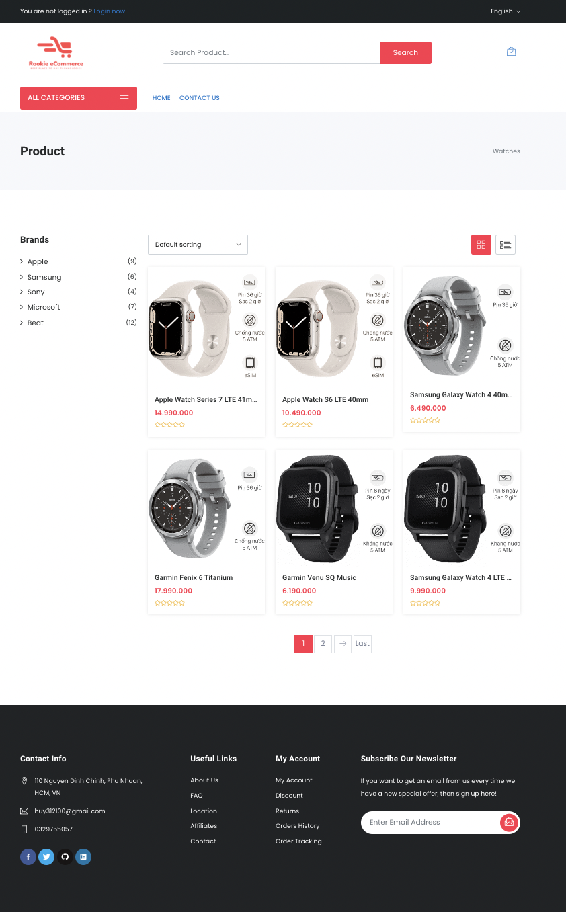
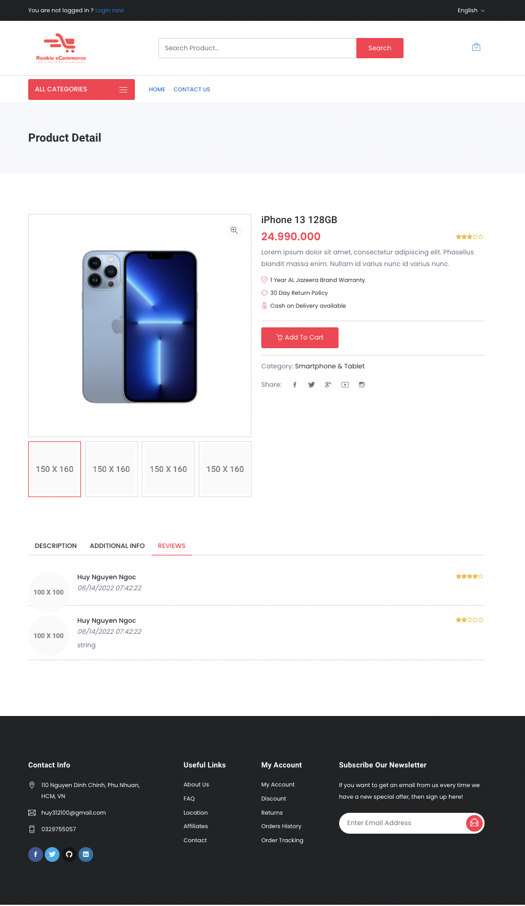
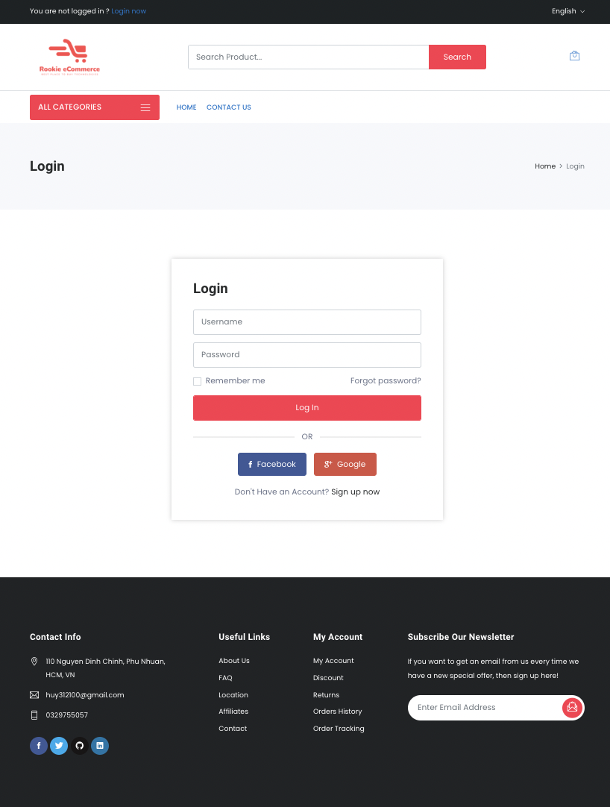
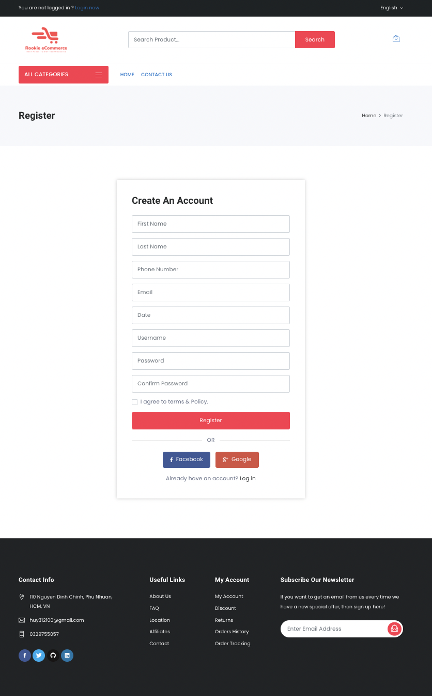
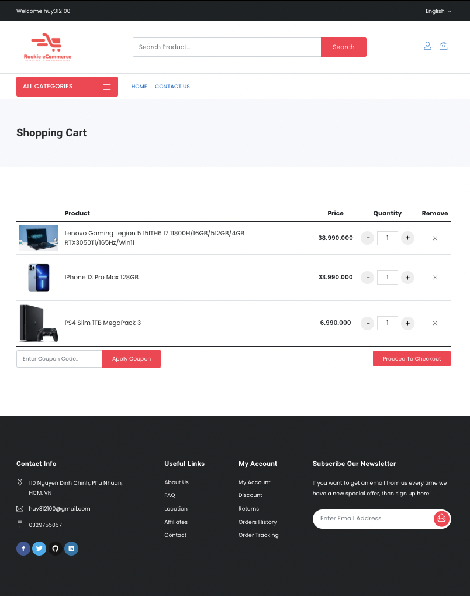
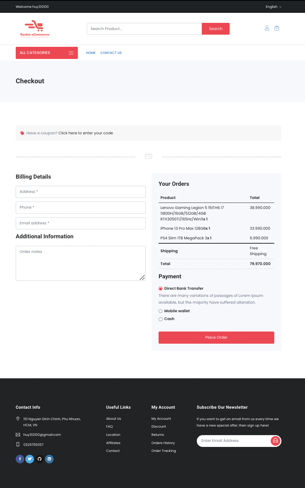

# Rookie Assignment Ecommerce

* Author: Huy Nguyen
* Mentor: Phong Nguyen 

## Logo

## Languages

## Frameworks

## Database

## Building an ecommerce web site with minimum functionalities below:

#### 1. Customer site (storefront): Using MVC pattern for this site.
* Home page: category menu, features products
* View products by category
* View product details
* Product rating
* Register
* Login/Logout
* Optional (shopping cart, ordering)

#### 2.Admin site: Using Single Page Application (SPA): API + ReactJS for this site.
* Login/Logout
* Manage categories (Name, Description)
* Manage products (Name, Category, Description, Price, Images, CreatedDate, UpdatedDate)
* View customers

### Note

* Project should apply as many techniques as possible which learned from training program. 
  - For .NET example: TagHelpers, ViewComponents…

* UnitTest: The Unit Test do not need to have a high coverage number but should demonstrate the ability to write unit test for common components.

***
## Screenshots
### 1. Customer

    
    
Homepage

     
    
    
Product List

     
    
    
Product Detail

     
    
    
Login

     
    
    
Sign Up

     
    
    
Cart

     
    
    
Confirm Order

     

